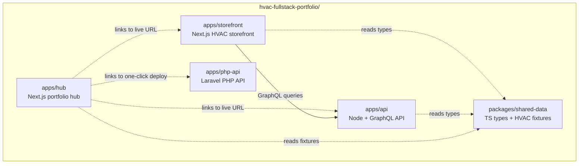

# hvac-fullstack-portfolio

> Recruiter-facing portfolio demonstrating **Next.js**, **Node.js + GraphQL**, **PHP (Laravel 11)**, and **TypeScript**.
> Built for the Sept 8, 2026 Robert Half virtual interview — Senior Software Engineer – Full Stack Developer (HVAC Distribution client).

---

## Live demo

- **Hub** (recruiter landing page): <https://hvac-fullstack-portfolio-hub.vercel.app>
- **Storefront** (HVAC parts eCommerce demo): <https://hvac-fullstack-portfolio-storefront.vercel.app>
- **Node GraphQL API** (live, on Render): <https://hvac-fullstack-portfolio-api.onrender.com/graphql>
- **PHP REST API** (one-click deploy button in [`apps/php-api/README.md`](apps/php-api/README.md))

These URLs are populated after U2–U4 deploy.

---

## Five apps, one monorepo

| Path | Stack | Deploy target |
| --- | --- | --- |
| [`apps/hub`](apps/hub) | Next.js 15 + shadcn-style UI | Vercel |
| [`apps/storefront`](apps/storefront) | Next.js 15 + TanStack Query + Zustand | Vercel |
| [`apps/api`](apps/api) | Node.js 22 + graphql-yoga + Pothos | Render |
| [`apps/php-api`](apps/php-api) | Laravel 11 + SQLite | Render one-click |
| [`packages/shared-data`](packages/shared-data) | TypeScript types + 25 HVAC fixtures | n/a (source-only) |

`pnpm install` at the repo root sets up all four apps and the shared package. `pnpm dev` boots them in parallel via Turborepo.

---

## Five JD technologies demonstrated

- **Next.js** — `apps/hub` (portfolio landing), `apps/storefront` (eCommerce demo)
- **Node.js** — `apps/api` (Express + GraphQL service for the storefront)
- **GraphQL** — schema-first via Pothos, served by graphql-yoga, consumed via TanStack Query
- **PHP** — `apps/php-api` (Laravel 11 REST API with deliberately legacy field naming for cross-stack realism)
- **JavaScript / TypeScript** — strict TS across all Node/Next.js projects, ESM modules

---

## Architecture decisions

The full decision matrix lives in **[`docs/CONTROLS.md`](docs/CONTROLS.md)** — what was chosen, why, and what alternatives were considered (monorepo tooling, GraphQL framework, deployment topology, data-variation strategy, etc.).

---

## Documentation walk order

Per the interview-prep pattern (README → talking-points → CONTROLS → diagrams → runbook):

1. [`docs/README.md`](docs/README.md) — 30-second pitch
2. [`docs/talking-points.md`](docs/talking-points.md) — interview answers per technology
3. [`docs/CONTROLS.md`](docs/CONTROLS.md) — architecture decisions matrix
4. [`docs/diagrams/`](docs/diagrams) — architecture, data-flow, deploy SVGs
5. [`docs/runbook.md`](docs/runbook.md) — deploy steps, env setup, troubleshooting

### High-level topology



---

## Quick start

```bash
pnpm install
pnpm dev
```

This boots all four apps in parallel via Turborepo. Each app has its own README with per-app setup.

---

## Why this exists

This repo is the candidate's evidence for the five technologies named in the Robert Half JD. Each app is intentionally small enough to read end-to-end in 5–10 minutes — recruiters reviewing the codebase should find polished code, clear architecture, and a deployment story, not a "real product" with all the complexity that implies.

See [`docs/CONTROLS.md`](docs/CONTROLS.md) for the explicit scope boundaries and non-goals.

---

## License

Portfolio project. Not for redistribution.
