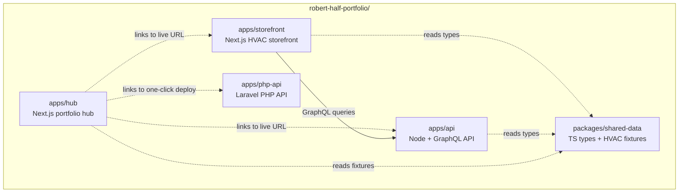

## Summary

Build a deployable portfolio monorepo showcasing Next.js, Node.js + GraphQL, PHP, and TypeScript for a Robert Half recruiter evaluating the candidate for a Senior Software Engineer – Full Stack Developer role (HVAC Distribution / Digital Commerce client). Hub + storefront ship live on Vercel; the Node GraphQL API ships live on Render; the PHP API ships as a one-click Render deploy button. Documentation follows the NiaHealth interview-prep walk order (README → talking-points → CONTROLS → diagrams → runbook).

## Problem Frame

The candidate has a virtual interview on Sept 8, 2026 (4 days from today, Sept 4, 2026) for a 12-month Senior Software Engineer – Full Stack Developer contract through Robert Half, targeting a client in HVAC Distribution / Digital Commerce. The JD lists five distinct technology areas (Next.js, Node.js, GraphQL, PHP, TypeScript) the recruiter will want concrete evidence of before the interview. Without a portfolio, the recruiter has only the resume to assess against the JD.

## Requirements

R1. The portfolio hub ships at a public Vercel URL with a polished landing page, project cards linking to each showcase, an about page, and mobile responsiveness.

R2. The Next.js HVAC parts storefront ships at a public Vercel URL and demonstrates a customer-facing eCommerce flow (browse → product detail → cart → checkout mock), consuming the live Node GraphQL API.

R3. The Node.js + GraphQL backend service exposes a `products` query, a `product(sku)` query, and a `createProduct` mutation, seeded with at least 20 HVAC products across categories: furnaces, filters, thermostats, motors, controls.

R4. The PHP REST API exposes `GET /api/parts`, `GET /api/parts/{id}`, and `POST /api/parts` endpoints on Laravel 11 + SQLite, demonstrating Eloquent ORM, Form Request validation, and CORS configuration.

R5. All non-PHP projects use TypeScript with strict mode, `@/*` path alias, and shared types where useful via `packages/shared-data`.

R6. The repository structure is a pnpm workspaces monorepo with Turborepo 2.x for task orchestration, avoiding the npm 11 vs CI npm 10 lockfile drift documented in MEMORY.

R7. The portfolio documentation follows the NiaHealth walk order: README (30-second pitch) → talking-points (interview answers) → CONTROLS matrix (architecture decisions) → SVG diagrams (architecture, data flow, deploy) → runbook (deploy + troubleshooting).

R8. Each project ships with a polished README documenting architecture choices, run instructions, and deploy steps.

R9. The Node GraphQL API is live on Render; the PHP API ships with a one-click Render deploy button (Render free tier permits only one live web service per account, so PHP is offered as deployable rather than live).

---

## Key Technical Decisions

KTD-1. Monorepo tooling: pnpm workspaces + Turborepo 2.x. The user is fluent in this stack via `better-auth`; it sidesteps the npm 11 vs CI npm 10 lockfile drift documented in MEMORY; Turborepo caches task output across the four apps.

KTD-2. GraphQL framework: graphql-yoga on Express with Pothos schema builder. Lightweight, modern, type-safe schema construction from TypeScript types defined in `packages/shared-data`. Apollo Server 4 was considered but is heavier with code-first schema duplication.

KTD-3. PHP framework: Laravel 11 with SQLite. Demonstrates real-world PHP patterns (Eloquent ORM, routing, Form Request validation, API Resources) more credibly than raw PHP; SQLite avoids Postgres setup overhead for a 4-day build.

KTD-4. Deployment topology: Vercel free tier for both Next.js apps (hub + storefront), Render free web service for the Node GraphQL API, GitHub repo + Render one-click deploy button for the PHP API. Render's free tier allows only one live web service per account, so PHP is offered as deployable-by-button rather than live.

KTD-5. Demo data strategy: shared HVAC products fixture in TypeScript used by hub, storefront, and Node API; PHP API uses its own legacy inventory schema (different field names: `part_number` vs `sku`, `unit_cost` vs `price`, `inventory_qty` vs `stock`) to demonstrate realistic cross-stack integration friction.

KTD-6. Documentation pattern: NiaHealth walk order — README → talking-points → CONTROLS → diagrams → runbook. The repo IS the demo for the recruiter; the README is the 30-second pitch and the runbook is the deploy story.

KTD-7. No real authentication, no real payment processing. Mock admin auth via header for mutations; mock checkout flow shows a success page only. Real auth and payments are out of scope for a 4-day build.

KTD-8. TypeScript strict, `@/*` path alias, ESM modules. Matches the user's existing conventions across `better-auth`, `niahealth-compliance-mvp`, and the broader corpus; no transpile-only shortcuts.

KTD-9. Testing depth: Vitest smoke tests for each Node/Next.js project, PHPUnit feature tests for the PHP API. No full coverage goal — smoke tests prove the build works and document the contract.

---

## High-Level Technical Design

The portfolio is a monorepo with four deployable surfaces and one shared data package:

User flow for the recruiter:

1. Lands on Hub — sees the four projects, bio, and tech stack badges.
2. Clicks Storefront — sees live HVAC parts catalog backed by the Node GraphQL API.
3. Clicks Node API — sees Render live URL + GraphQL Playground.
4. Clicks PHP API — sees GitHub repo + Render one-click deploy button.
5. Reviews `docs/CONTROLS.md` for the architecture decisions matrix.

The recruiter evaluates the codebase (recruiter reads code, not runs it), the live apps (recruiter clicks URLs), and the documentation (recruiter reads about decisions). All three audiences are served.

---

## Implementation Units

### U1. Bootstrap monorepo and shared data package

- **Goal:** Create the pnpm + Turborepo monorepo structure with root config, CI workflow, and the shared HVAC data package consumed by hub, storefront, and Node API.
- **Requirements:** R6
- **Dependencies:** none
- **Files:**
  - `package.json`
  - `pnpm-workspace.yaml`
  - `turbo.json`
  - `tsconfig.base.json`
  - `.gitignore`
  - `.editorconfig`
  - `.github/workflows/ci.yml`
  - `README.md` (top-level repo README, 30-second pitch)
  - `packages/shared-data/package.json`
  - `packages/shared-data/tsconfig.json`
  - `packages/shared-data/src/types.ts`
  - `packages/shared-data/src/products.ts` (at least 20 HVAC fixtures)
  - `packages/shared-data/src/categories.ts`
- **Approach:** Run `pnpm init`, install Turborepo 2.x, configure workspace glob `apps/*` and `packages/*`. Define `dev`, `build`, `lint`, `test` Turbo tasks with proper `dependsOn` chain. Shared data package exports TypeScript types (`Product`, `Category`, `Order`) and a static array of at least 20 realistic HVAC parts (furnaces, filters, thermostats, motors, controls) with realistic SKUs, prices, stock counts, and category tags. CI workflow runs `pnpm install --frozen-lockfile` and `turbo run lint test build` on PR.
- **Patterns to follow:** better-auth monorepo layout (`apps/*` + `packages/*`, catalog feature for shared dep versions); the user's existing TS strict + `@/*` alias convention.
- **Test scenarios:**
  - Test expectation: none — pure scaffolding. Manual verification: `pnpm install` succeeds, `turbo run build --dry-run` shows the expected task graph, `git init && git add . && git commit -m "feat: bootstrap monorepo"` succeeds.
- **Verification:** `pnpm install` succeeds; CI workflow runs without errors on first push; `turbo run build --dry-run` enumerates the four apps; `packages/shared-data` exports resolve from a scratch script.

### U2. Next.js portfolio hub

- **Goal:** Build and deploy the Next.js portfolio landing page with project cards, bio, and mobile responsiveness.
- **Requirements:** R1, R5
- **Dependencies:** U1
- **Files:**
  - `apps/hub/package.json`
  - `apps/hub/next.config.js`
  - `apps/hub/tsconfig.json`
  - `apps/hub/tailwind.config.ts`
  - `apps/hub/postcss.config.js`
  - `apps/hub/src/app/layout.tsx`
  - `apps/hub/src/app/page.tsx`
  - `apps/hub/src/app/about/page.tsx`
  - `apps/hub/src/app/projects/[slug]/page.tsx`
  - `apps/hub/src/components/Hero.tsx`
  - `apps/hub/src/components/Nav.tsx`
  - `apps/hub/src/components/ProjectCard.tsx`
  - `apps/hub/src/components/TechBadge.tsx`
  - `apps/hub/src/components/Footer.tsx`
  - `apps/hub/src/data/projects.ts` (project cards config)
  - `apps/hub/src/data/profile.ts` (bio + tech stack)
  - `apps/hub/src/lib/cn.ts` (clsx + tailwind-merge helper)
  - `apps/hub/public/favicon.ico`
  - `apps/hub/README.md`
  - `apps/hub/vercel.json`
  - `apps/hub/tests/smoke.test.ts`
- **Approach:** Next.js 15 App Router with TypeScript strict and `@/*` path alias. shadcn-style UI primitives: `class-variance-authority` + `clsx` + `tailwind-merge` + `lucide-react` + Radix. Home page: hero with candidate name, role pitch, and four project cards (Storefront, Node API, PHP API, About). Each card has a live URL or deploy button link, tech stack badges, and a one-line description. About page has a fuller bio + tech matrix + links to resume and GitHub. Project detail pages render long-form per-project architecture notes. Mobile responsive via Tailwind breakpoints. Deploy via Vercel dashboard with `NEXT_PUBLIC_STOREFRONT_URL`, `NEXT_PUBLIC_API_URL`, `NEXT_PUBLIC_PHP_REPO_URL` env vars.
- **Patterns to follow:** `niahealth-compliance-mvp` README structure for the About page; better-auth's Next.js layout; shadcn-style component patterns from the user's corpus.
- **Test scenarios:**
  - Happy: Home page renders with all 4 project cards visible and links resolve to 200.
  - Happy: About page renders with bio + tech badges.
  - Happy: Each project detail page (`/projects/storefront`, etc.) renders.
  - Happy: Mobile viewport (375px wide) renders without horizontal scroll.
  - Audit: Lighthouse mobile score ≥ 90 for performance and accessibility.
- **Verification:** `pnpm --filter hub dev` serves on localhost:3000; all routes return 200; Vitest smoke tests pass; deploy to Vercel succeeds; live URL returns 200 with expected content.

### U3. Next.js HVAC parts storefront

- **Goal:** Build and deploy the customer-facing HVAC parts eCommerce demo that consumes the Node GraphQL API.
- **Requirements:** R2, R5
- **Dependencies:** U1, U4 (the GraphQL API must exist for the storefront to query)
- **Files:**
  - `apps/storefront/package.json`
  - `apps/storefront/next.config.js`
  - `apps/storefront/tsconfig.json`
  - `apps/storefront/tailwind.config.ts`
  - `apps/storefront/postcss.config.js`
  - `apps/storefront/src/app/layout.tsx`
  - `apps/storefront/src/app/products/page.tsx`
  - `apps/storefront/src/app/products/[sku]/page.tsx`
  - `apps/storefront/src/app/cart/page.tsx`
  - `apps/storefront/src/app/checkout/page.tsx`
  - `apps/storefront/src/components/ProductCard.tsx`
  - `apps/storefront/src/components/ProductGrid.tsx`
  - `apps/storefront/src/components/ProductDetail.tsx`
  - `apps/storefront/src/components/CartItem.tsx`
  - `apps/storefront/src/components/AddToCartButton.tsx`
  - `apps/storefront/src/components/CartSummary.tsx`
  - `apps/storefront/src/components/Header.tsx`
  - `apps/storefront/src/lib/graphql.ts` (urql or Apollo Client setup)
  - `apps/storefront/src/lib/cart.ts` (Zustand cart store with localStorage persistence)
  - `apps/storefront/src/data/fallback-products.ts` (static fallback when API is down)
  - `apps/storefront/README.md`
  - `apps/storefront/vercel.json`
  - `apps/storefront/tests/cart.test.ts` (Zustand store unit tests)
  - `apps/storefront/tests/graphql.test.ts` (fetcher unit tests)
- **Approach:** Next.js 15 App Router with TypeScript strict. RSC for product listing and detail pages (server-side GraphQL fetch with cache). Client components for cart, add-to-cart button, and checkout. TanStack Query for client-side query caching; Zustand for cart state with `persist` middleware for localStorage. GraphQL fetcher uses `graphql-request` (lightweight) or urql with the live `NEXT_PUBLIC_API_URL`. Product list page renders 20+ HVAC parts grouped by category. Product detail page shows full description, specs, stock, price, and an Add-to-Cart button. Cart page lists items with quantity controls and total. Checkout page is a mock — shows a success message after a brief delay. Error boundary on each page renders a friendly "cached data" notice if the API is unreachable.
- **Patterns to follow:** TanStack Query + Zustand stack from user's corpus; shadcn-style UI from U2; urql or `graphql-request` for lightweight client.
- **Test scenarios:**
  - Happy: `/products` lists all 20+ products with name, price, stock, category from the live API.
  - Happy: `/products/{sku}` shows full detail for one product.
  - Happy: Add-to-cart on product detail page updates cart count in the header.
  - Happy: `/cart` shows added items with quantities and total.
  - Happy: Cart persists across page reloads (localStorage).
  - Edge: Empty cart renders an "empty cart" message.
  - Edge: `/products/non-existent-sku` renders a "not found" message.
  - Error: When `NEXT_PUBLIC_API_URL` is unreachable, product list renders fallback static data with a "showing cached data" notice.
  - Mobile: Mobile viewport (375px wide) renders without horizontal scroll.
  - Audit: Lighthouse mobile score ≥ 90 for performance and accessibility.
- **Verification:** `pnpm --filter storefront dev` serves on localhost:3001; all routes return 200; cart state persists across navigation and reload; Vitest unit tests pass; deploy to Vercel succeeds with `NEXT_PUBLIC_API_URL` pointing at the live Render URL; live storefront queries the live API and renders real data.

### U4. Node.js + GraphQL backend service

- **Goal:** Build and deploy the Node + GraphQL backend service with seeded HVAC data, used by the storefront.
- **Requirements:** R3, R5
- **Dependencies:** U1
- **Files:**
  - `apps/api/package.json`
  - `apps/api/tsconfig.json`
  - `apps/api/src/server.ts` (Express + Yoga entry)
  - `apps/api/src/schema/builder.ts` (Pothos schema builder)
  - `apps/api/src/schema/product.ts` (Product type, queries, mutation)
  - `apps/api/src/schema/index.ts` (schema assembly)
  - `apps/api/src/data/store.ts` (in-memory product store)
  - `apps/api/src/data/seed.ts` (loads from `packages/shared-data` fixtures)
  - `apps/api/src/middleware/cors.ts`
  - `apps/api/src/middleware/auth.ts` (mock admin auth via header)
  - `apps/api/Dockerfile`
  - `apps/api/render.yaml` (Render one-click deploy)
  - `apps/api/.env.example`
  - `apps/api/README.md`
  - `apps/api/tests/api.test.ts` (Vitest integration tests via Yoga's `executeOperation`)
- **Approach:** Express + graphql-yoga + Pothos schema builder on Node 22. Pothos derives the GraphQL schema from TypeScript types in `packages/shared-data`, giving end-to-end type safety. Endpoints:
  - `query products(category: String): [Product!]!` — returns all products, optional category filter.
  - `query product(sku: String!): Product` — returns one product or null.
  - `mutation createProduct(input: CreateProductInput!): Product!` — admin-only (header check), creates a new product.

  In-memory store seeded at boot from `packages/shared-data` fixtures (no DB for the 4-day window). CORS configured to allow the storefront origin. `helmet` for security headers. `zod` for input validation in the mutation. Dockerfile + `render.yaml` for one-click Render deploy. README documents the GraphQL Playground URL.
- **Patterns to follow:** Express + `tsx watch` + `helmet` + `cors` + `zod` from user's Node backend corpus (PasswordManager, AWS projects).
- **Test scenarios:**
  - Smoke: server boots on `PORT` (default 4000); `GET /healthz` returns 200.
  - Smoke: GraphQL introspection returns the schema.
  - Happy: `query { products { id sku name price stock category } }` returns at least 20 seeded products.
  - Happy: `query { product(sku: "FURN-001") { name price } }` returns one product.
  - Happy: `query { products(category: "Filters") { sku } }` filters by category.
  - Edge: `query { product(sku: "DOES-NOT-EXIST") { name } }` returns null with no error.
  - Error: `mutation createProduct(input: { sku: "" })` returns validation error.
  - Error: `mutation createProduct` without admin header returns 403.
  - Error: Invalid GraphQL syntax returns 400 with parse error.
- **Verification:** `pnpm --filter api dev` serves on localhost:4000; all queries return expected data; mutation validates input; Dockerfile builds and runs locally; Vitest tests pass; Render deploy succeeds; live URL responds to `/healthz` and GraphQL queries.

### U5. Laravel 11 PHP REST API

- **Goal:** Build the standalone Laravel 11 PHP REST API demonstrating PHP skills with one-click Render deploy.
- **Requirements:** R4
- **Dependencies:** none (independent of Node API; demonstrates cross-stack data variation)
- **Files:**
  - `apps/php-api/composer.json`
  - `apps/php-api/.env.example`
  - `apps/php-api/Dockerfile`
  - `apps/php-api/render.yaml`
  - `apps/php-api/app/Http/Controllers/PartController.php`
  - `apps/php-api/app/Http/Requests/StorePartRequest.php`
  - `apps/php-api/app/Http/Requests/UpdatePartRequest.php`
  - `apps/php-api/app/Http/Resources/PartResource.php`
  - `apps/php-api/app/Models/Part.php`
  - `apps/php-api/app/Providers/AppServiceProvider.php`
  - `apps/php-api/database/migrations/2026_09_04_000001_create_parts_table.php`
  - `apps/php-api/database/seeders/PartsSeeder.php`
  - `apps/php-api/database/seeders/DatabaseSeeder.php`
  - `apps/php-api/database/factories/PartFactory.php`
  - `apps/php-api/routes/api.php`
  - `apps/php-api/config/cors.php`
  - `apps/php-api/phpunit.xml`
  - `apps/php-api/README.md`
  - `apps/php-api/tests/Feature/PartApiTest.php` (PHPUnit feature tests)
  - `apps/php-api/tests/TestCase.php`
- **Approach:** Laravel 11 (latest LTS) with SQLite database, Eloquent ORM. Migration creates a `parts` table with deliberately different field names than the Node API (`part_number` vs `sku`, `unit_cost` vs `price`, `inventory_qty` vs `stock`, `bin_location` extra column) to demonstrate realistic legacy-integration variation. Seeder populates at least 15 parts across Filters, Motors, Controls, Ductwork categories. Endpoints:
  - `GET /api/parts` — list with optional `category` filter and pagination.
  - `GET /api/parts/{id}` — single part.
  - `POST /api/parts` — create, validated via `StorePartRequest`.

CORS allows all origins in dev (locked down via env in prod). API Resource shapes responses consistently. Dockerfile + `render.yaml` + one-click deploy button in README. PHPUnit feature tests cover happy + error paths.
- **Patterns to follow:** Standard Laravel 11 conventions; Form Request validation; API Resource for response shaping.
- **Test scenarios:**
  - Smoke: `php artisan serve` boots on localhost:8000; `GET /api/parts` returns 200 with JSON array.
  - Happy: `GET /api/parts` returns at least 15 parts with `part_number`, `name`, `unit_cost`, `inventory_qty`, `category`.
  - Happy: `GET /api/parts/1` returns one part.
  - Happy: `GET /api/parts?category=Filters` filters by category.
  - Edge: `GET /api/parts/99999` returns 404.
  - Error: `POST /api/parts` with missing required fields returns 422 with validation messages.
  - Error: `POST /api/parts` with negative `unit_cost` returns 422.
- **Verification:** `php artisan migrate:fresh --seed` succeeds; all endpoints return expected responses; PHPUnit feature tests pass; Dockerfile builds and runs locally; Render one-click deploy works.

### U6. Portfolio documentation set (NiaHealth walk order)

- **Goal:** Produce the recruiter-facing documentation that walks through architecture and demonstrates the project's thinking.
- **Requirements:** R7
- **Dependencies:** U2, U3, U4, U5 (documentation describes the deployed projects)
- **Files:**
  - `docs/README.md` (top-level docs entry — 30-second pitch: project name, 5 bullets, tech stack badges, link to live hub)
  - `docs/talking-points.md` (interview answers: walk through each tech, key design choices, "what would you do differently")
  - `docs/CONTROLS.md` (architecture decisions matrix: decision, choice, rationale, alternative considered, status)
  - `docs/diagrams/architecture.svg` (component topology, hand-coded SVG)
  - `docs/diagrams/data-flow.svg` (sequence diagram: user → hub → storefront → API → response)
  - `docs/diagrams/deploy.svg` (deployment topology: Vercel + Render + GitHub)
  - `docs/runbook.md` (deploy steps, env var setup, troubleshooting common errors: CORS, port mismatch, build failures)
- **Approach:** Mirror the NiaHealth walk order: README (30-second pitch) → talking-points → CONTROLS matrix → SVG diagrams → runbook. Hand-code the SVGs (not auto-generated) to demonstrate deliberate visual design and avoid third-party deps. Talking-points covers the 5 techs, key decisions, and trade-offs — written as the answer to "tell me about your portfolio." CONTROLS.md is a structured matrix per project. Runbook covers Vercel deploy, Render one-click, env var setup, free-tier gotchas. Reference `CONTROLS.md` from the root README so the recruiter finds it on first read.
- **Patterns to follow:** NiaHealth interview-prep pattern from MEMORY (`niahealth-compliance-mvp-project.md`).
- **Test scenarios:**
  - Test expectation: none — content artifact. Manual review only.
- **Verification:** README renders cleanly in GitHub markdown; all SVG diagrams render in browsers; CONTROLS matrix is internally consistent with implementation choices; runbook deploy steps work for a fresh reviewer following the steps.

---

## Scope Boundaries

### Deferred to Follow-Up Work

- Real authentication (OAuth, JWT, Laravel Sanctum) — deferred beyond the 4-day window; mock admin auth via header for mutations.
- Real payment processing (Stripe, etc.) — deferred; mock checkout flow only.
- Database persistence for the Node API — in-memory store only for the 4-day window.
- Comprehensive test coverage — smoke tests only; deferred to a follow-up coverage PR.
- CI/CD pipelines beyond the root GitHub Actions — no per-service CI; Render handles its own build/deploy.
- Production-grade observability (logging, metrics, error tracking) — out of scope for a portfolio.
- CMS for product data — static fixtures only.
- E2E Playwright tests — deferred; manual visual verification only for the 4-day window.

### Outside the Product's Identity

- The portfolio is a demo, not a real eCommerce platform. No real customers, no real transactions, no PII handling.
- The portfolio is a recruiter-facing artifact. Optimize for clarity and signal density, not for production scalability.

---

## Risks & Dependencies

R-Risk-1. Render free tier allows only one web service per account. Mitigation: ship Node GraphQL API as a live Render deploy; ship PHP API as a one-click Render deploy button in the README. Documented in runbook.

R-Risk-2. Four-day deadline is tight for four deployable apps + monorepo + docs. Mitigation: prioritize hub + storefront polish (the recruiter's first two clicks), keep API + PHP at "solid demo" level. If hub + storefront exceed Day 3, defer PHP API to a follow-up repo rather than ship incomplete.

R-Risk-3. Vercel free tier 100 GB bandwidth limit. Mitigation: portfolio traffic will be under 1 GB; not a concern for demo.

R-Risk-4. Laravel deployment friction on Render requires custom Dockerfile. Mitigation: provide tested Dockerfile + `render.yaml`; document quirks in README and runbook.

R-Risk-5. Network failure during interview demo (the hub or storefront URL is down). Mitigation: include fallback screenshots in `docs/diagrams/`; storefront renders static fallback when API is unreachable; README has local-runnable instructions via `docker compose up`.

R-Risk-6. No prior art for GraphQL or PHP in user's projects. Mitigation: choose mainstream frameworks (graphql-yoga + Pothos, Laravel 11) with strong documentation; the 4-day window is sufficient for focused learning.

R-Risk-7. Commit hygiene drift under deadline pressure. Mitigation: per memory, strip Claude Code footer from all commits; follow scope discipline (only files in each unit's Files: list); check `git log --oneline -2` and `git stash list` after noisy "command not found" errors per husky pre-commit pattern.

---

## Open Questions

OQ-1. Should the monorepo be public or private on GitHub? Default: public (recruiter can clone or browse without auth). Action: confirm with user before pushing.

OQ-2. Should the portfolio include a downloadable resume PDF, or just a link to the existing resume? Default: link only (user can attach the PDF to the email themselves). Action: confirm before U6 finalization.

OQ-3. Should the GitHub repo name be `robert-half-portfolio` (recruiter-specific) or `hvac-fullstack-portfolio` (technology-focused)? Default: `hvac-fullstack-portfolio` — more memorable, signals domain alignment. Action: confirm before U1 commit.

---

## Sources & Research

- **NiaHealth interview-prep pattern** (memory `niahealth-compliance-mvp-project.md`): README → talking-points → SVGs → CONTROLS → runbook. Mirrored in U6 and in the root README structure.
- **pnpm + Turborepo over npm** (memory `kanadojo-windows-npm-11-vs-ci-npm-10.md` + repo research): npm 11 lockfile normalization breaks CI; user is fluent in pnpm + Turborepo via better-auth. Drives KTD-1.
- **TypeScript strict + `@/*` alias** (repo research): universal across user's Next.js corpus (better-auth, niahealth, GAMEZ). Drives KTD-8.
- **Express + `tsx watch` + `helmet` + `cors` + `zod`** (repo research): dominant Node backend pattern (PasswordManager, AWS projects). Drives U4 approach.
- **Vitest + Playwright testing** (repo research): Vitest dominant for unit, Playwright for E2E; PHPUnit standard for Laravel. Drives KTD-9.
- **GitHub Actions CI pattern** (repo research): `pnpm install --frozen-lockfile` + Turbo task matrix, with `concurrency` group per workflow. Drives U1 CI workflow.
- **GraphQL/PHP greenfield** (repo research): no prior art in user's corpus. Default to graphql-yoga + Pothos and Laravel 11; mainstream frameworks with strong docs.
- **Render free tier constraint** (repo research): one free web service per account. Drives KTD-4 deployment topology.
- **Husky pre-commit pitfall** (memory `kanadojo-husky-lint-staged-pre-commit.md`): pre-commit may auto-stash working tree on partial lint failure; check `git log` and `git stash list` after noisy errors. Drives R-Risk-7.
- **`tsc --noEmit` CI pitfall** (memory `kanadojo-check-script-needs-commitinfo.md`): pre-generate any build-time JSON imports. Drives U1 CI workflow to generate fixtures before typecheck.
- **No Claude Code footer in commits/PRs** (memory `no-claude-code-footer-in-commits-prs.md`): user-level rule, strip the footer from commit messages and PR bodies. Drives R-Risk-7.

No external web research was run. User's tech fluency is high, framework choices are mainstream, and the 4-day deadline makes additional research costly.