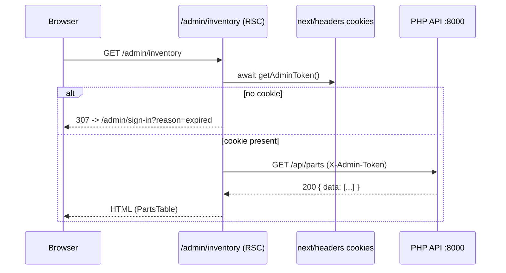
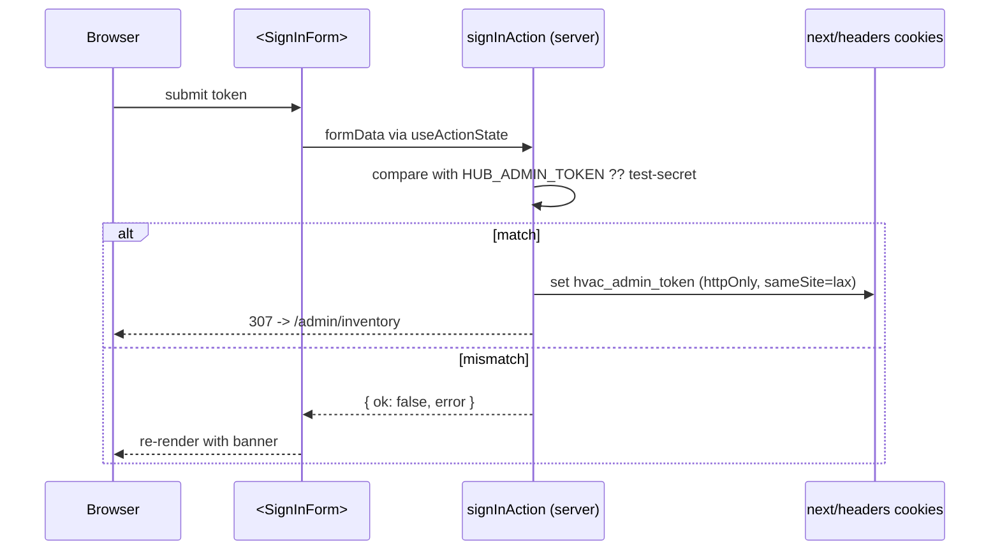

# Plan — Admin Inventory UI in the Hub App

## Summary

Add a `/admin` route group to `apps/hub` so a non-technical user can list, create, and edit HVAC parts through the browser. The form posts to the existing Laravel PHP REST API at `apps/php-api`. The hub does not own the data and does not store the admin token persistently — it holds a single signed-in session per browser via an httpOnly cookie.

This is **not** a full multi-tenant auth system. It is a single shared-token admin surface for a portfolio demo where one recruiter will sign in once and click through. Production replacement (OAuth/Auth0/magic link) lives in a follow-up.

---

## Problem Frame

Today the PHP API exposes `POST /api/parts` and `PATCH /api/parts/{part}`, but the only way to invoke them is `curl` with the right header. A non-technical user — the recruiter during the Sept 8 interview, or the user themselves reviewing the demo — cannot add or edit a part without a terminal. The portfolio already shows the customer-facing storefront; the missing piece is the operator-facing CRUD page that proves the back-office side of the system is real.

**Why it matters:** without an admin UI the back-office API is invisible in a browser-only demo. The recruiter would have to trust that "POST works" from reading code. With an admin UI the recruiter clicks *Sign in*, types the demo token, lands on the parts list, adds a part, and sees it appear in the database — the same loop a real parts manager would use.

**Scope boundary:**

- **In scope:** list/create/edit pages, sign-in/sign-out, validation mirroring Laravel's rules, tests for the helper layer, end-to-end smoke.
- **Deferred for later:** delete (no DELETE endpoint in PHP API yet), bulk import, multi-user accounts, rate limiting, audit log, password reset, magic-link sign-in.
- **Outside this product's identity:** anything that turns this from "demo admin" into "production admin" — OAuth, MFA, RBAC, encrypted-at-rest audit. The env-var token is the deliberate demo stand-in for those.

---

## Requirements

| ID | Requirement | Origin |
|---|---|---|
| R1 | A non-technical user can sign in with a single token and reach `/admin/inventory`. | User request |
| R2 | `/admin/inventory` lists every part returned by `GET /api/parts` (paginated). | Derived from PHP API contract |
| R3 | `/admin/inventory/new` lets the user create a part via `POST /api/parts` with the same field set Laravel's `StorePartRequest` validates. | PHP API contract |
| R4 | `/admin/inventory/[part]` lets the user edit an existing part via `PATCH /api/parts/{part}`. `{part}` is `part_number` (alphanumeric SKU), not numeric `id`. | PHP API contract |
| R5 | The category dropdown shows only the four PHP-API-allowed values (`Filters | Motors | Controls | Ductwork`). Submitting any other value returns 422; the form surfaces that error. | `apps/php-api/app/Http/Controllers/PartController.php:21` |
| R6 | `unit_cost` is rendered as a number on the form, but Laravel's `decimal:2` cast returns it as a string on the wire. The form must coerce on submit; tests assert the wire format. | `apps/php-api/app/Models/Part.php:24` |
| R7 | Missing/expired cookie on any `/admin/*` page redirects to `/admin/sign-in` with a banner. | Auth flow |
| R8 | Sign-out clears the cookie and lands on `/admin/sign-in` with a confirmation banner. | Auth flow |
| R9 | Server-side validation mirrors Laravel's rules for inline UX, AND Laravel's 422 errors surface when the server rejects. | User decision (call-out #2) |
| R10 | Admin token source is `HUB_ADMIN_TOKEN` env var with `test-secret` as the dev fallback. Production secret swaps in via env without code change. | User decision (call-out #1) |
| R11 | No Claude-Code footer in commits/PR bodies. | User rule (memory) |
| R12 | Commit only files in this unit's `Files:` list; prose mentions of paths are not authorization. | User rule (memory) |

---

## Key Technical Decisions

### KTD-1 — httpOnly cookie over localStorage for token storage

The token is held in a `hvac_admin_token` httpOnly + `sameSite=lax` cookie set by a server action. JS never reads it; XSS in the hub cannot exfiltrate it. `server-only` import on the helper file prevents accidental client bundling. Trade-off: cookie clears on browser close is acceptable; the recruiter signs in once per demo.

### KTD-2 — Server Actions over Route Handlers for mutations

The `useActionState` + `useFormStatus` pattern in Next.js 15 is purpose-built for forms, and server actions let us co-locate cookie reads with the form's mutation. Route handlers are reserved for non-React callers (e.g. a future webhook). Source: Next.js 15 `mutating-data` docs.

### KTD-3 — Page-level auth check, not middleware

The repo has no `middleware.ts` today. Adding one for this single feature is over-engineering. Each `/admin/*` page does `if (! await getAdminToken()) redirect('/admin/sign-in?reason=expired')`. The shared `admin/layout.tsx` renders chrome only — it does NOT call `redirect`; each protected page owns its own auth check at the top. Putting the redirect in the layout would create a redirect loop on `/admin/sign-in` itself, since that route lives under the same layout. If a future feature needs request-level gating across many routes, *then* add middleware. Documented as deferred.

### KTD-4 — Server Components fetch PHP API directly via plain `fetch`

No HTTP client library is installed in the hub. Adding one for a single endpoint is unnecessary — `fetch` is global and works in both RSC and server actions. The helper module owns the URL resolution and error wrapping; the page just calls the helper.

### KTD-5 — Mirror Laravel's validation rules in a shared Zod schema

A single Zod schema in `apps/hub/src/lib/part-schema.ts` defines field types, required-ness, and constraints that match `StorePartRequest`. Imported by both the form client component (live inline validation) and the server action (server-side validation gate that runs before the PHP API call). Server-side validation is authoritative; client-side is UX.

### KTD-6 — Type the wire shape explicitly

`apps/hub/src/lib/parts.ts` defines `Part`, `CreatePartInput`, `UpdatePartInput`, and `PartsListResponse` interfaces. `unit_cost` is typed as `string` because that's what the PHP API returns. The form coerces `number` → `string` before submit. This asymmetry is documented in the type's JSDoc.

### KTD-7 — Categorical dropdown scoped to PHP API's allowed set

The category `<select>` lists exactly `Filters`, `Motors`, `Controls`, `Ductwork` — never `Furnaces` or `Thermostats` (those exist in the Node API's `ProductCategory` but are not accepted by the PHP `StorePartRequest`). Trade-off: the hub admin UI cannot add parts in the Node API's superset; that asymmetry mirrors the actual API contract.

### KTD-8 — Env var name `HUB_ADMIN_TOKEN` (no `NEXT_PUBLIC_` prefix)

The token is server-only. The env var carries no `NEXT_PUBLIC_` prefix so it is never bundled into the client. Default fallback is the literal string `test-secret` so `pnpm dev` works out of the box; production sets `HUB_ADMIN_TOKEN` via Vercel dashboard.

### KTD-9 — PHP API URL from `PHP_API_URL` (no `NEXT_PUBLIC_` prefix)

Same reasoning. Default `http://localhost:8000` for local dev. Production sets via Vercel dashboard.

### KTD-10 — `useActionState` for form state, `useFormStatus` for pending UI

React 19 + Next.js 15 idiom. Server action returns `{ ok: true, data } | { ok: false, fieldErrors: { [field]: string[] } }`; the client component renders field errors inline and a submit button that disables itself via `useFormStatus().pending`.

---

## Implementation Units

### U1. Fence the admin feature: foundation, types, server-only helpers

**Goal:** Stand up the lib-layer building blocks the admin UI consumes. After this unit, the token cookie roundtrip is testable in isolation and the types are wired into the test suite.

**Files:**
- `apps/hub/src/lib/admin-token.ts` — already exists on disk (untracked). Promote to tracked as-is. Stays the read-only server-only helper: `import 'server-only'`, `ADMIN_TOKEN_COOKIE` constant, `getAdminToken()`, `hasAdminToken()`. No server actions here — keeping this file pure means pages/RSCs import a thin server-only module.
- `apps/hub/src/lib/admin-token-actions.ts` — new. Marked `'use server'` at file top so every export is a server action. Exports `signInAction(prevState, formData)` (compares token against `HUB_ADMIN_TOKEN ?? 'test-secret'`, calls `setAdminToken` on match, returns `{ ok: false, error }` on mismatch), `signOutAction()` (calls `clearAdminToken`), plus thin `setAdminToken(value)` / `clearAdminToken()` cookie writers. The cookie writers set `path: '/admin'` so the admin token only travels with requests to `/admin/*` routes — the storefront and customer-facing pages never see it in the request headers. **Fail-closed posture in production:** the module reads `HUB_ADMIN_TOKEN` at import time; when `process.env.NODE_ENV === 'production'` and the env var is unset, the module throws at boot rather than falling back to `'test-secret'`. This mirrors the PHP API's `render.yaml` posture (which intentionally leaves `ADMIN_TOKEN` unset and fails closed) so a misconfigured production hub cannot accidentally accept the literal dev secret. Server actions rely on Next.js 15's built-in origin check for CSRF protection; do not configure `serverActions.allowedOrigins` to widen the allowlist without a security review. Reason for a separate file: `'use server'` at file top makes every export an RPC, which would also turn `getAdminToken` into an RPC — wrong shape. Splitting the read-only helpers from the action exports keeps each file's contract crisp.
- `apps/hub/src/lib/parts.ts` — new. Defines `Part`, `CreatePartInput`, `UpdatePartInput`, `PartsListResponse`, `PartsFetchError`, plus the four fetcher functions: `listParts(token)`, `getPart(token, partNumber)`, `createPart(token, input)`, `updatePart(token, partNumber, input)`. `listParts` always passes `?per_page=100` (the PHP API's controller max is 100; the default of 25 would silently truncate the list if the recruiter adds more than 25 parts during the demo). The file also resolves `PHP_API_URL` from `process.env.PHP_API_URL` at call time with `http://localhost:8000` as the dev default (no separate `php-api-url.ts` module — single-use helper lives inline). **Production scheme guard:** when `NODE_ENV === 'production'`, the URL resolver throws if the resolved URL's protocol is not `https:` so the admin token never crosses a cleartext wire. Every fetcher call goes through an internal `request(url, init)` helper that wraps `fetch` with a 5-second `AbortController` timeout — a hung PHP API produces a `PartsFetchError` instead of an indefinite blank page. The fetcher also sanitizes upstream error bodies before constructing `PartsFetchError`: on a 422 it keeps only `errors` (the Laravel validation shape); on any other non-2xx it keeps only a generic `{ error: <statusText> }` so debug-mode stack traces and SQL fragments never reach the browser. Also exports the `submitPartAction` server action (marked with inline `'use server'` so the file can keep its regular exports and the action co-locates with the fetchers). A small `formDataToInput(formData: FormData)` helper lives alongside the action so the FormData → typed-input mapping is unit-testable in isolation (no React render needed for the validation logic).
- `apps/hub/src/lib/part-schema.ts` — new. Zod schema mirroring `StorePartRequest` rules: required `part_number` (max 50), `name` (max 255), `description`, `unit_cost` (number, min 0), `inventory_qty` (int, min 0), `bin_location` (optional, max 50), `category` (enum: Filters|Motors|Controls|Ductwork), `manufacturer` (max 100). Export `CATEGORIES` constant.
- `apps/hub/package.json` — modify. Add `zod` to `dependencies`. The hub does not currently depend on `zod` (verified via `apps/hub/package.json`); the schema in `part-schema.ts` requires it.
- `apps/hub/.env.example` — new. Documents `HUB_ADMIN_TOKEN` (default `test-secret`) and `PHP_API_URL` (default `http://localhost:8000`).
- `apps/hub/tests/admin/admin-token.test.ts` — new. Covers cookie set/get/clear and `server-only` guard.
- `apps/hub/tests/admin/admin-token-actions.test.ts` — new. Covers `signInAction` happy/error paths and `signOutAction` (asserts cookie cleared and redirect issued).
- `apps/hub/tests/admin/parts.test.ts` — new. Mocks `fetch`, asserts each function builds the right URL, attaches the right header, parses the response, and throws `PartsFetchError` on non-2xx.
- `apps/hub/tests/admin/part-schema.test.ts` — new. Asserts each rule from `StorePartRequest` is mirrored.

**Approach:**
- `parts.ts` returns `{ data, usedFallback: false } | { data: null, usedFallback: true, error }`. On non-2xx, throws `PartsFetchError` with the upstream status and a parsed `{ error }` or `{ errors }` body.
- The fetcher takes a `token` argument explicitly — no implicit reads. Pages pass the cookie value in. This makes the fetcher testable without mocking `next/headers`.
- The `CATEGORIES` constant is the single source of truth for the dropdown; the schema imports it so they cannot drift.

**Patterns to follow:**
- `apps/storefront/src/lib/graphql.ts:23-31` — custom error class.
- `apps/storefront/src/lib/graphql.ts:124-145` — `*WithFallback` return shape.
- `apps/storefront/tests/graphql.test.ts` — `vi.stubGlobal('fetch', ...)` pattern.
- `apps/hub/tests/smoke.test.ts` — existing hub test that establishes the test organization (relative imports from `../src/data/...`, top-level `describe`/`it`, `expect(...).toEqual(...)`). The new `apps/hub/tests/admin/*.test.ts` files follow the same style.
- `apps/hub/src/lib/admin-token.ts` (the existing on-disk file) — read-only server-only helper shape.
- Next.js 15 server actions: `'use server'` at file top marks every export as an RPC; `'use server'` inline at function top marks a single function. Choose based on whether the file mixes server actions with regular server-only functions (we mix → inline on `submitPartAction`; we don't mix in admin-token-actions.ts → file-top directive).

**Test scenarios:**
- *Happy path:* `listParts('token')` with a mocked 200 paginated response returns the unwrapped `data` array.
- *Auth header:* every fetcher attaches `X-Admin-Token: <token>` (assert via captured `fetch` mock).
- *URL composition:* `getPart(token, 'PHP-001')` hits `<PHP_API_URL>/api/parts/PHP-001` (URL-encoded path segment). The PHP API seeder uses `PHP-###` prefixes exclusively; SKU examples in tests must match.
- *Edge case — empty list:* 200 with `{ data: [], meta: {...} }` returns `[]`, not throws.
- *Edge case — non-alphanumeric SKU:* `getPart(token, 'PHP-HEPA-20x25-12')` URL-encodes the `/` to `%2F` and the rest stays literal.
- *Error — 403:* thrown error has `status: 403`, `body: { error: 'Admin authentication required' }`.
- *Error — 422:* thrown error has `status: 422`, `body: { errors: { unit_cost: [...] } }` — sanitized: `message` and any other Laravel top-level keys are dropped, only `errors` is propagated.
- *Error — 404:* thrown error has `status: 404` (missing part on edit page); body sanitized to `{ error: 'Not Found' }`.
- *Error — network:* `fetch` rejects → `PartsFetchError` wraps the cause.
- *Error — timeout:* a fetch that takes >5s (mocked via `AbortError`) → `PartsFetchError` with status `0` and a generic `body`.
- *Production fail-closed:* importing `admin-token-actions.ts` with `NODE_ENV=production` and `HUB_ADMIN_TOKEN` unset throws at module load (asserted by `expect(() => import(...)).toThrow()`).
- *Cookie path scope:* `setAdminToken('token')` followed by a `cookies()` read returns the cookie, and the cookie object's `path` is `'/admin'`.
- *Schema:* each Laravel rule has a matching Zod rule; `unit_cost` allows `0` but rejects negative; `category` rejects `Furnaces` and `Thermostats`.
- *formDataToInput helper:* `formDataToInput(formDataLike({ part_number: 'PHP-X', unit_cost: '89.99', ... }))` returns `{ part_number: 'PHP-X', unit_cost: 89.99, ... }` (number coercion, no React render needed).
- *Test hygiene:* each test file in `tests/admin/` starts with `vi.mock('server-only')` at the top to keep the happy-dom environment from choking on the bare-imports pattern.

**Verification:** `pnpm turbo run test --filter=hub` passes; `apps/hub/tests/admin/*.test.ts` are green.

---

### U2. Sign-in page, sign-out action, auth-gated redirect

**Goal:** The user lands on `/admin/sign-in`, types the demo token, and arrives at `/admin/inventory`. Sign-out clears the cookie.

**Files:**
- `apps/hub/src/app/admin/layout.tsx` — new. Server component. Renders shared chrome (header with the sign-out button) and wraps `{children}`. Does NOT call `redirect` or `getAdminToken()` — that's per-page responsibility (see KTD-3 and the Approach below).
- `apps/hub/src/app/admin/sign-in/page.tsx` — new. Server component. Renders the `<SignInForm>` client component. Reads `?reason=expired` and surfaces a banner if present.
- `apps/hub/src/components/admin/SignInForm.tsx` — new. `'use client'`. `<form action={signInAction}>` with a single password input. Uses `useActionState` to surface a "token rejected — try again" error from the server action. Disables the submit button via `useFormStatus().pending`.
- `apps/hub/src/app/admin/inventory/page.tsx` — new. Server component. Gated by its own per-page auth check at the top; reads `getAdminToken()` and renders the parts list.
- `apps/hub/src/components/admin/SignOutButton.tsx` — new. `'use client'`. `<form action={signOutAction}>` with a hidden submit button styled as a button. Posts and waits for the redirect.
- `apps/hub/.env.example` — already in U1; this unit documents the demo token in the README at `apps/hub/README.md`.

**Approach:**
- The layout file does NOT do the redirect; each protected page calls `if (! await getAdminToken()) redirect('/admin/sign-in?reason=expired')` at its top. This is more explicit than the alternative and avoids the layout-vs-sign-in-page redirect loop (a redirect in the layout would also fire on `/admin/sign-in` itself, looping back to itself).
- `signInAction` in `admin-token-actions.ts`: reads form value, compares with `process.env.HUB_ADMIN_TOKEN ?? 'test-secret'`. Match → `setAdminToken(value)`, then `redirect('/admin/inventory')`. Mismatch → return `{ ok: false, error: 'Token rejected' }`.
- `signOutAction` in `admin-token-actions.ts`: `clearAdminToken()`, then `redirect('/admin/sign-in?reason=signed_out')`.

**Patterns to follow:**
- `apps/hub/src/app/projects/[slug]/page.tsx:30-37` — `notFound()` pattern (we use `redirect()`).
- Next.js 15 form docs: `useActionState` + `useFormStatus` pattern with `safeParse` for validation.

**Test scenarios:**
- *Happy path — sign in:* submit correct token → cookie set → redirect to `/admin/inventory`.
- *Error — wrong token:* form re-renders with "Token rejected" error; no cookie set; no redirect.
- *Auth gate:* visit `/admin/inventory` without cookie → redirect to `/admin/sign-in?reason=expired`.
- *Sign out:* click sign-out button → cookie cleared → redirect to `/admin/sign-in?reason=signed_out`.
- *Banner on sign-in:* `?reason=expired` shows "Your session expired — please sign in again"; `?reason=signed_out` shows "You've been signed out".

**Verification:** manual walkthrough at `http://localhost:3000/admin/inventory` (signed out → sign-in → signed in → sign-out). `pnpm turbo run typecheck --filter=hub` clean. Component renders without hydration errors in the browser console.

---

### U3. Parts list page

**Goal:** The user sees every part returned by `GET /api/parts` in a table with category, unit cost, qty, bin, and an "Edit" link.

**Files:**
- `apps/hub/src/app/admin/inventory/page.tsx` — new (created in U2; expanded here). Becomes the list page. Server component. Awaits `listParts(await getAdminToken())`. Renders `<PartsTable parts={...} />` and a "New part" link to `/admin/inventory/new`. Reads `?created=<sku>` (set by `submitPartAction` after a successful create) and renders a success banner: "Part `<sku>` created." Reads `?updated=<sku>` similarly after a successful edit.
- `apps/hub/src/app/admin/inventory/loading.tsx` — new. Suspense fallback shown while `listParts` is in flight. Skeleton rows with the same column count as `<PartsTable>`.
- `apps/hub/src/app/admin/inventory/error.tsx` — new. Client component (`'use client'`) that renders a "Could not load parts — try again" banner when the fetcher throws. Receives the error and a `reset()` callback from Next.js.
- `apps/hub/src/app/admin/inventory/[part]/loading.tsx` — new. Same skeleton pattern as the list loading state.
- `apps/hub/src/app/admin/inventory/[part]/error.tsx` — new. Same error banner pattern as the list error state.
- `apps/hub/src/components/admin/PartsTable.tsx` — new. Server component (no interactivity beyond the row link). Columns: SKU, name, category, unit cost (formatted `$X.XX`), qty, bin location, edit link.
- `apps/hub/src/components/admin/EmptyState.tsx` — new. Server component. Shown when the API returns 0 parts.
- `apps/hub/src/components/admin/ApiErrorBanner.tsx` — new. Server component. Shown when the fetcher returns `usedFallback: true` with a "PHP API unreachable" warning.

**Approach:**
- Pagination: PHP API paginates at 25 per page by default. For the demo with seeded 20 parts, no pagination UI is needed; if the dataset grows, add `?page=` query handling later. Documented in scope-boundary as deferred.
- `unit_cost` is typed as `string` (Laravel cast); the component formats it as `$X.XX` using `parseFloat(part.unit_cost).toLocaleString(...)`. JSDoc on `Part.unit_cost` notes the cast.
- The "New part" CTA sits above the table; uses Tailwind tokens already in `apps/hub/src/app/globals.css`.

**Patterns to follow:**
- `apps/storefront/src/components/ProductGrid.tsx` — table-grid layout with category badge pattern.
- `apps/hub/src/components/TechBadge.tsx` — pill-style category badge.

**Test scenarios:**
- *Happy path:* seeded API returns 20+ parts → table renders all rows.
- *Edge case — empty list:* API returns `{ data: [] }` → EmptyState shows "No parts yet — add the first one".
- *Edge case — API unreachable:* fetcher returns `usedFallback: true` → ApiErrorBanner shows + EmptyState.
- *Edit link:* every row's "Edit" link points to `/admin/inventory/<part_number>` with the URL-encoded SKU.

**Verification:** visit `/admin/inventory` after sign-in → see 20+ rows from the seed; "Edit" link works (lands on the edit page from U4).

---

### U4. Create + Edit forms with shared validation

**Goal:** A single form component renders for both new and edit flows; submits via Server Action; surfaces Laravel 422 errors inline.

**Files:**
- `apps/hub/src/app/admin/inventory/new/page.tsx` — new. Server component. Renders `<PartForm mode="create" />`.
- `apps/hub/src/app/admin/inventory/[part]/page.tsx` — new. Server component. Awaits `getPart(await getAdminToken(), params.part)`. If 404, `notFound()`. Renders `<PartForm mode="edit" part={...} />`.
- `apps/hub/src/app/admin/inventory/[part]/not-found.tsx` — new. 404 page with a "Back to inventory" link.
- `apps/hub/src/components/admin/PartForm.tsx` — new. `'use client'`. Takes `mode: 'create' | 'edit'` and optional `part?: Part`. Renders all fields with proper labels and Tailwind classes. Submits via Server Action `submitPartAction(prevState, formData)`. Uses `useActionState` to display `fieldErrors[field]` below each input. Disables submit via `useFormStatus`.
- `apps/hub/src/lib/parts.ts` (modified in U1) — add `submitPartAction` server action here. Calls `createPart(token, validated.data)` or `updatePart(token, partNumber, validated.data)` based on `mode`. Returns `{ ok: false, fieldErrors }` on Zod failure or upstream 422; returns `{ ok: true, redirectTo: '/admin/inventory' }` on success (the client navigates with `useRouter().push(...)`).
- `apps/hub/tests/admin/parts.test.ts` (modified in U1) — add tests for `submitPartAction` covering: missing required field → `{ ok: false, fieldErrors }`; upstream 422 → propagates as `{ ok: false, fieldErrors }` keyed by field name; success → `{ ok: true }` and cookie/header assertions.

**Approach:**
- The Zod schema (U1) runs first in the server action. Failures short-circuit with field errors so the user sees them without a round-trip.
- On `ok: true`, the client component calls `router.push('/admin/inventory?created=<sku>')` (or `?updated=<sku>` for edits) and `router.refresh()` so the list reflects the new/edited row and the success banner is visible.
- `part_number` is editable on the create form but read-only on the edit form (changing PK on an existing row is a separate feature).
- The unit_cost input has `type="number" step="0.01"`; submit-time coercion `parseFloat(...)` happens before the fetcher call.
- **Laravel 422 → fieldErrors mapping rule:** the action copies `errors → fieldErrors` verbatim (key rename only; the value `string[]` arrays pass through). The client component renders `fieldErrors[field][0]` below each input. This is documented inline in `submitPartAction` and asserted in the unit test.

**Patterns to follow:**
- Next.js 15 forms guide: `useActionState` + `useFormStatus` with `safeParse` (research finding §3). This is the first `useActionState`/`useFormStatus` occurrence in the repo — there is no in-repo pattern to cite; we follow the docs directly.

**Test scenarios:**
- *Happy path — create:* valid form submit → POST hits PHP API with correct payload → redirect to `/admin/inventory`.
- *Happy path — edit:* valid form submit → PATCH hits `/api/parts/<part_number>` → redirect.
- *Error — Zod failure:* missing `part_number` → field error appears under input; no POST issued.
- *Error — Laravel 422:* server action submits to PHP, PHP returns 422 with `{ errors: { unit_cost: [...] } }` → same field errors render.
- *Edge case — duplicate part_number on create:* PHP returns 422 → error appears under `part_number`.
- *Edge case — invalid category on submit:* even though the `<select>` only allows the 4 valid values, defense-in-depth: PHP 422 surfaces as field error if it ever happens.
- *404 — unknown SKU on edit:* `/admin/inventory/UNKNOWN-SKU` → `notFound()` → renders not-found.tsx.
- *Edge case — unit_cost formatting:* form sends `89.99` as number; PHP returns `'89.99'` as string on read.

**Verification:** create a new part in the UI → see it in `/admin/inventory` list → edit it → confirm the change in the DB via `php artisan tinker` or a fresh list render. All scenarios pass.

---

### U5. End-to-end smoke + commit

**Goal:** Verify the full flow works against the live PHP API on `http://localhost:8000`, then commit scope-disciplined to this unit.

**Files:** none new.

**Approach:**
- Boot all four apps via `pnpm turbo run dev` (already working).
- Walk through the recruiter demo path: visit `http://localhost:3000/admin/inventory` (signed out) → redirected to sign-in → type `test-secret` → land on inventory → see seeded parts → click "New part" → fill form → submit → redirected back to list with new row → click "Edit" → change qty → save → see updated row → click "Sign out" → redirected to sign-in.
- `php artisan test` → 11/11 still green (PHP API not modified).
- `pnpm turbo run lint test typecheck` → green across the board.
- Commit with conventional prefix `feat(hub):` per repo convention (cf. recent commits `03aade9 feat(storefront): ...`).
- **Commit must not include any file outside this unit's `Files:` lists.** Specifically: no PHP API changes; no Node API changes; no storefront changes; no shared-data changes; no `apps/hub/src/lib/admin-token.ts` from before today (already untracked — fold its commit into U1's commit). Document this in the commit body.
- **No `🤖 Generated with [Claude Code]` footer in the commit body** (user rule).

**Test scenarios:** this unit is verification-only — covered by U1-U4's tests.

**Verification:**
- Manual walkthrough succeeds.
- All four test suites green.
- Commit message contains no Claude Code footer.
- Commit scope contains only files in U1-U4's `Files:` lists.

---

## High-Level Technical Design

### Sequence — sign-in + read list



### Sequence — sign-in submit



### Component topology

```
apps/hub/src/
├── app/admin/
│   ├── layout.tsx                    [shared chrome — header w/ sign-out]
│   ├── sign-in/page.tsx              [renders <SignInForm>]
│   ├── inventory/
│   │   ├── page.tsx                  [list; uses listParts()]
│   │   ├── new/page.tsx              [renders <PartForm mode="create">]
│   │   └── [part]/page.tsx           [renders <PartForm mode="edit">]
│   │   └── [part]/not-found.tsx
└── components/admin/
    ├── SignInForm.tsx                ['use client'; useActionState]
    ├── SignOutButton.tsx             ['use client'; form action]
    ├── PartsTable.tsx                [server component]
    ├── EmptyState.tsx
    ├── ApiErrorBanner.tsx
    └── PartForm.tsx                  ['use client'; useActionState, useFormStatus]
```

---

## Scope Boundaries

### In scope

- `/admin/sign-in`, `/admin/inventory`, `/admin/inventory/new`, `/admin/inventory/[part]` (edit page lives at `[part]/page.tsx`, no `/edit` segment)
- httpOnly cookie session with `set`/`get`/`clear` via server actions
- Zod schema mirroring `StorePartRequest`
- Server Actions for mutations; plain `fetch` for reads
- Tests for the lib layer (admin-token, parts, part-schema)
- Smoke walkthrough + commit

### Deferred for later (intentionally out of this plan's U-IDs)

- **Pagination UI** — PHP API supports `?per_page=` and paginates; the UI doesn't render page links yet (20 seeded parts fit on one page). When the dataset grows, add `?page=` handling.
- **Delete** — no `DELETE /api/parts/{part}` exists yet; a follow-up plan would add it to PHP API then the hub UI.
- **Multi-user accounts / OAuth** — explicitly out per scope boundary.
- **Audit log** — no trail of who-edited-what; would need a `parts_audit` table on the PHP side and a query surface.
- **Magic-link sign-in** — would replace env-var token; out of scope.
- **Form-level optimistic updates** — submit and wait for the round-trip; UX is already fast against localhost.
- **Bulk import (CSV upload)** — distinct feature, separate plan.
- **`middleware.ts`** — page-level auth check is enough until > 5 protected routes exist.
- **`docs/solutions/` institutional learnings** — the agent recommended creating the directory to capture the cross-stack pattern after this ships. This is a chore, not a feature.

### Outside this product's identity

- Production-grade auth (OAuth/Auth0/SAML/magic-link) — would replace `HUB_ADMIN_TOKEN` entirely.
- Rate limiting / abuse protection.
- Encrypted-at-rest audit, GDPR data-handling considerations.
- Anything that requires more than the existing PHP API's POST/PATCH surface.

---

## Risks & Dependencies

| Risk | Mitigation |
|---|---|
| PHP API is down during local dev | List page shows `ApiErrorBanner`; create/edit forms surface "PHP API unreachable" with the cause. No silent failure. |
| Laravel decimal cast returns `unit_cost` as string | `Part.unit_cost: string` in TypeScript; form input is `type="number"`; coercion at submit time. Tests assert both wire format and form input type. |
| Hub has no `middleware.ts`; if a future feature adds many gated routes, the per-page check becomes noisy | Documented in KTD-3. Add middleware when the threshold is hit. |
| Category enum divergence with Node API's `shared-data` types | Hub admin does NOT import `ProductCategory` from `shared-data` — it defines its own `CATEGORIES` constant in `part-schema.ts`. The two namespaces are independent by design. |
| `HUB_ADMIN_TOKEN` is checked against the literal string `test-secret` in dev. If a developer changes the env var, sign-in silently accepts the new value. | Documented in `.env.example` and README. Production sets a strong secret via Vercel dashboard. |
| External research (Next.js 15 docs) — the agent marked this load-bearing for `cookies()` async semantics and the `useActionState`/`useFormStatus` pattern | Captured in KTD-2, KTD-5, KTD-10. The plan's KTDs cite the relevant doc URLs. |

**Dependencies:**

- PHP API must be running for the admin UI to work end-to-end. The local `.env` already sets `ADMIN_TOKEN=test-secret`.
- Next.js 15.1.4 is already on the hub. No version bump.
- One new runtime dependency: `zod` is added to `apps/hub/package.json` in U1 to back the shared validation schema. Everything else (`fetch`, `cookies()`, `useActionState`, `useFormStatus`) ships with Next.js 15 / React 19 and is already in the lockfile.

---

## Deferred to Implementation

- Exact CSS class composition for the form layout (Tailwind, follows existing patterns — see `apps/hub/src/app/globals.css`).
- The exact wording of the "API unreachable" banner copy.
- Whether to render a confirmation modal before sign-out (deferred — sign-out is a small action; click-and-go is fine for the demo).
- Error message wording for the 422 → field-error mapping (Laravel's messages will pass through; no translation layer needed).

---

## Acceptance Examples

| ID | Description |
|---|---|
| AE1 | A recruiter with the demo token can sign in once, add a new part via the form, and see it in the list within 2 seconds. |
| AE2 | A recruiter who edits a part's `inventory_qty` from 50 to 25 sees the new value in the list after saving. |
| AE3 | A recruiter who closes the browser and reopens it is signed out (cookie is a true session cookie — no `maxAge` set — so it clears when the browser session ends). |
| AE4 | A recruiter who tries to sign in with a wrong token sees a "Token rejected" error and stays on the sign-in page. |
| AE5 | A recruiter who navigates to `/admin/inventory` while signed out is redirected to `/admin/sign-in?reason=expired` with a banner. |
| AE6 | A recruiter who tries to create a part with `unit_cost: -5` sees "Unit cost must be at least 0" inline below the field. |
| AE7 | A recruiter who submits a duplicate `part_number` sees "The part number has already been taken" below the SKU field. |
| AE8 | A recruiter who edits `/admin/inventory/UNKNOWN-SKU` sees the 404 page with a back link. |

---

## Operational / Rollout Notes

- **Local dev:** `pnpm turbo run dev` boots all four apps; `HUB_ADMIN_TOKEN` falls back to `test-secret`. The recruiter signs in with that token.
- **Production:** set `HUB_ADMIN_TOKEN` and `PHP_API_URL` in the Vercel dashboard for the hub project. The PHP API URL is the production Render URL. The `render.yaml` for the PHP API intentionally leaves `ADMIN_TOKEN` unset (fail-closed) — to demo the admin UI in production, set it via Render env vars.
- **CORS:** the hub's server components fetch PHP directly. No CORS change needed.
- **Cookie security:** `httpOnly`, `sameSite=lax`, `secure: true` in production. The `secure: true` flag is set conditionally based on `process.env.NODE_ENV === 'production'`. Cookie is also scoped to `path: '/admin'` so the admin token only travels with requests to `/admin/*` routes — the storefront and customer-facing pages never see it in their request headers. We deliberately do NOT use the `__Host-` cookie prefix: `__Host-` requires `Path=/` (no admin-scoped path) and `Secure` (which would break local dev over `http://localhost`). The explicit `path: '/admin'` gives us a tighter scope than `__Host-` would allow.
- **Token handling contract:** the raw admin token never appears in error messages, logs, or client-visible state. `signInAction` returns only `{ ok: false, error: 'Token rejected' }` on a mismatch — the submitted token is not echoed back. Server-action error reporters (Sentry et al., if added later) must redact the `HUB_ADMIN_TOKEN` cookie value. The PHP API's Laravel access logs must redact the `X-Admin-Token` header value (Laravel middleware or log scrubber).

---

## Sources & Research

- **Next.js 15 docs (load-bearing):** `cookies()` is async since v15.0.0-RC; server actions can `set` cookies and Next.js re-renders the current page so subsequent reads see the new value. `useActionState` returns `(state, dispatch, pending)`; pair with `useFormStatus` for the submit button's pending state. `import 'server-only'` prevents accidental client bundling.
  - https://nextjs.org/docs/app/api-reference/functions/cookies
  - https://nextjs.org/docs/app/getting-started/mutating-data
  - https://nextjs.org/docs/app/guides/forms
  - https://nextjs.org/docs/app/getting-started/server-and-client-components
  - https://react.dev/reference/react/useActionState
  - https://react.dev/reference/react-dom/hooks/useFormStatus
- **Repo research (load-bearing):** the untracked `apps/hub/src/lib/admin-token.ts` already establishes the cookie-name + server-only pattern. PHP API contract from `apps/php-api/app/Http/Controllers/PartController.php`, `StorePartRequest.php`, `UpdatePartRequest.php`, `PartResource.php`. Test patterns from `apps/storefront/tests/graphql.test.ts` (fetch mock + module reset).
- **Institutional learnings:** `docs/solutions/` does not exist in this repo. No prior art to draw on; the post-ship recommendation is to capture the cross-stack admin-UI pattern as a new entry under `docs/solutions/architecture_patterns/` (deferred chore, not in this plan).
